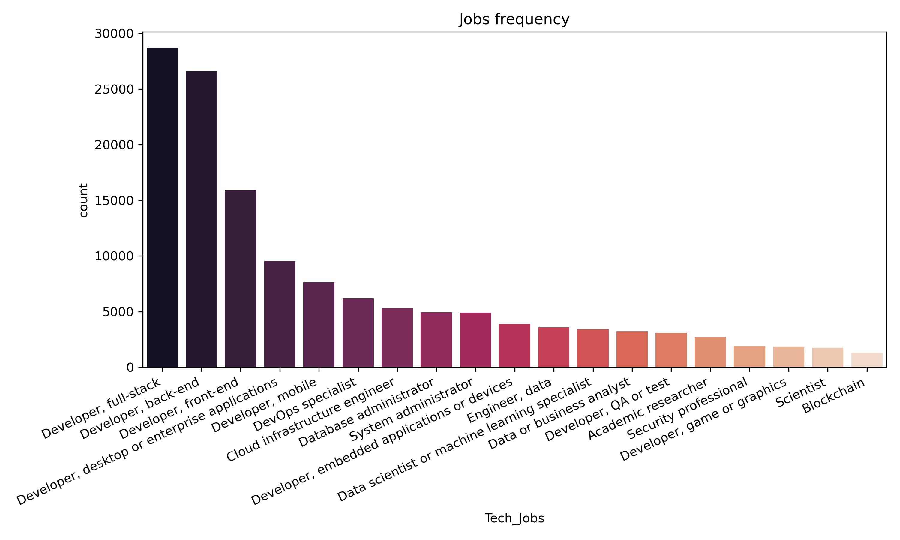
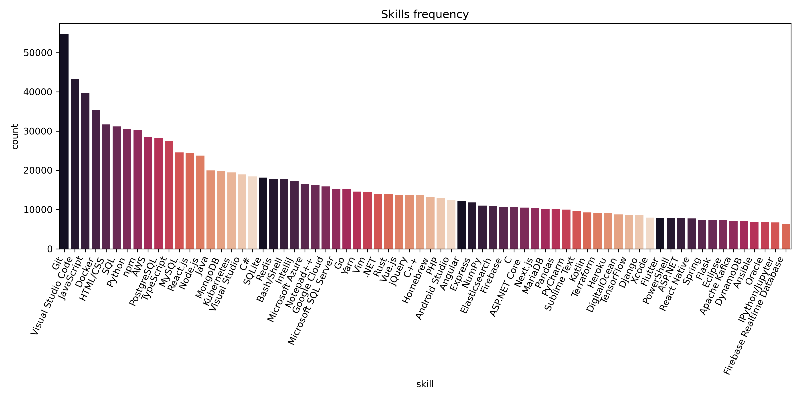
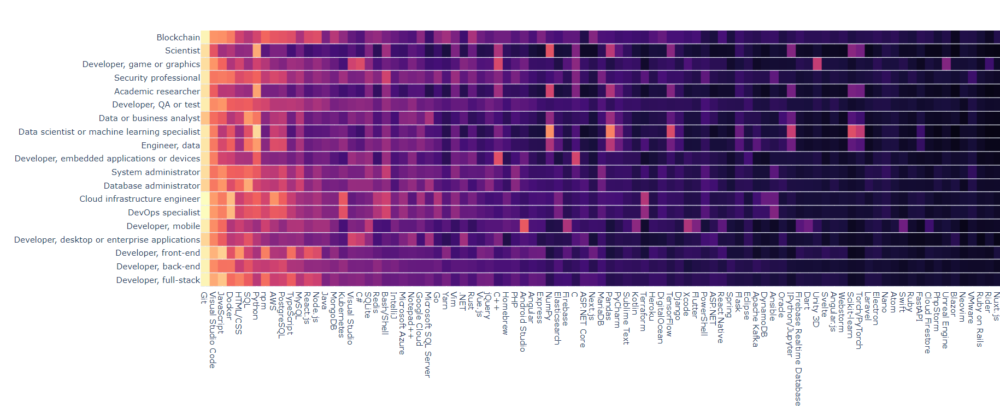
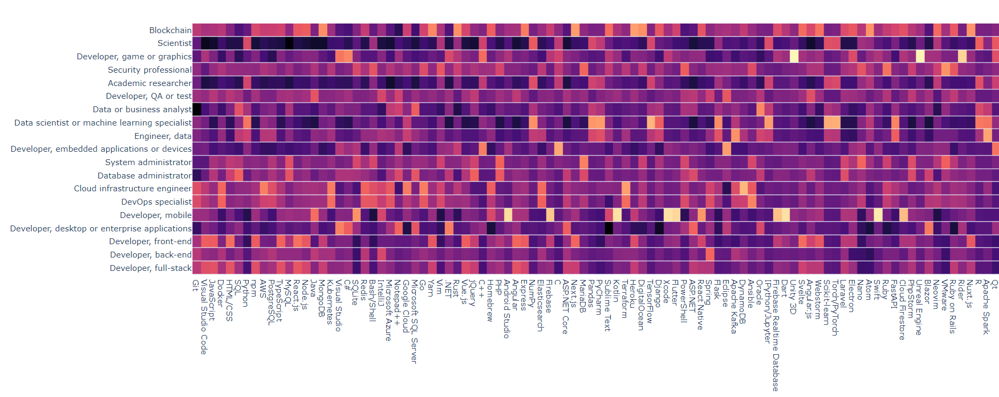
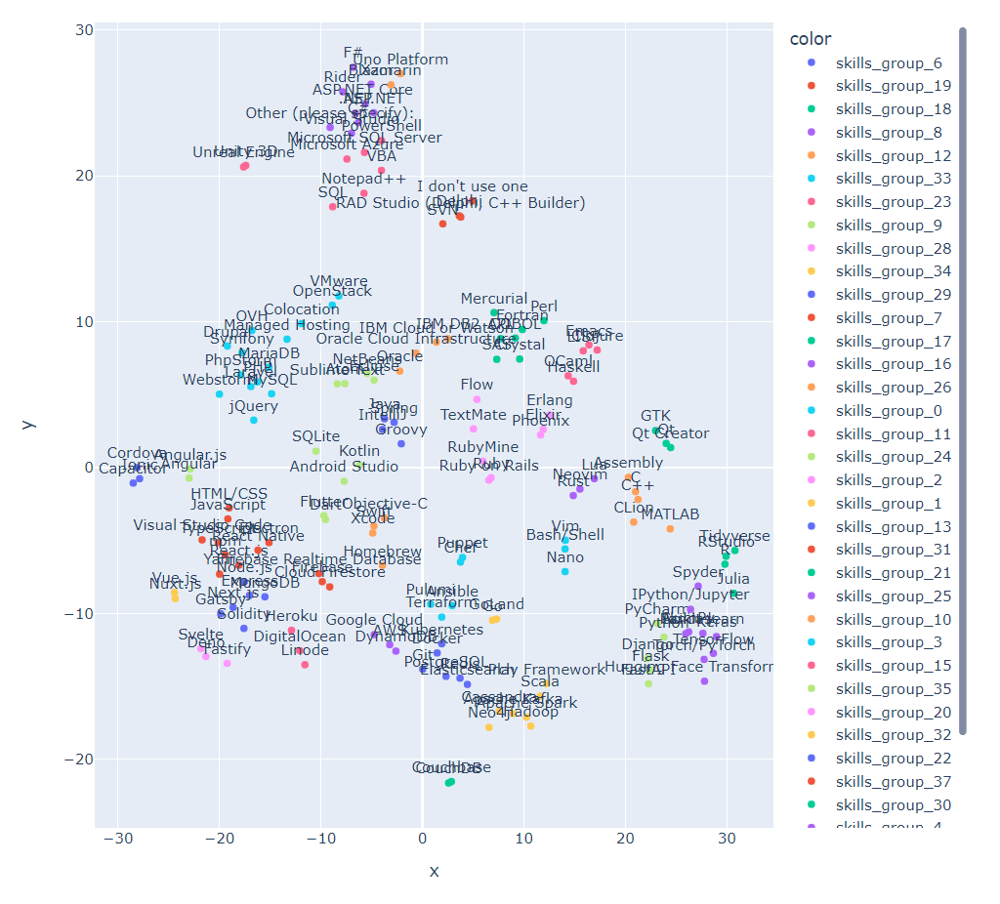
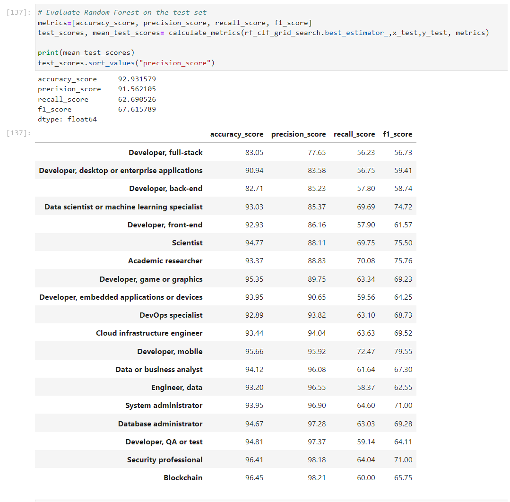

# Tech Jobs Prediction Based On Your Skillset Project

## Business Overview
- **Our client is an IT educational institute. They have reached out to us has reach out with the following:**

- **IT jobs and technologies keep evolving quickly. This makes our field to be one of the most interesting out there. But on the other hand, such fast development confuses our students. They do not know which skills they need to learn for which job.**

    - Do I need to learn C++ to be a Data Scientist?
    - Do DevOps and System admins use the same technologies?
    - I really like JavaScript; can I use it in Data Analytics?

## Business Objective
- **Develop a Data-Driven solution that gives each student the skills needed to learn which job.**
- **Understand the relationships between the jobs and the technologies.**

## KPIs
- **Higher enrollment rate due to higher certainty** 
- **Decrease in drop-out rate**
- **Time saved for the academic advisors**

## Frame the Problem
- **Given we have a labeled Dataset and the labels consists of multiple classes that can output multiple binary tags `DevType`.**
- **We are dealing with a `Supervised MultiLabel Classification` Task.**
- **Also there is no continous flow of data coming into the system, So we are going to use `Batch learning`.**

## Performance Measure
- **We are dealing with a `classification problem` with `Imbalanced dataset`, We will focus on Precision, Recall, F1-score**
- **Also we need to make sure the predicted job must be true to recommend skills, we are going to Focus precisely on `Precision`** 

## Data Source
- **We will work on Stack Overflow Developers Survey Dataset of 2022**
- https://info.stackoverflowsolutions.com/rs/719-EMH-566/images/stack-overflow-developer-survey-2022.zip

## Data Understanding
- The Dataset consists of **73000** rows and **79** columns, With alot of  **missing** values  due to the nature of the survey and no **duplicates**.

-  **Core Features:**
    - `VersionControlSystem`,
    - `LanguageHaveWorkedWith`, `LanguageWantToWorkWith`,
    - `DatabaseHaveWorkedWith`, `DatabaseWantToWorkWith`,
    - `PlatformHaveWorkedWith`, `PlatformWantToWorkWith`,
    - `WebframeHaveWorkedWith`, `WebframeWantToWorkWith`,
    - `MiscTechHaveWorkedWith`,M`iscTechWantToWorkWith`,
    - `ToolsTechHaveWorkedWith`,T`oolsTechWantToWorkWith`,
    - `NEWCollabToolsHaveWorkedWith`, `NEWCollabToolsWantToWorkWith`
- **Labels:**
    - `DevType`
    
- **Both `Core Features` and `Labels` consists of multiple values separated by `;` that need to be preprocessed differently.**
 
- **We are dealing with a `multi-label Imbalanced Dataset`.**

## Data Preprocessing
- **Remove non_related features, Keep only `Core features` and `Labels`.**
- **Split multiple values features.**
    - `Assembly;C;C#;C++;Delphi;SQL` ==> `['Assembly', 'C', 'C#', 'C++', 'Delphi', 'SQL']`
- **Combine Related Features.**
    - `Languages` = `LanguageHaveWorkedWith` + `LanguageWantToWorkWith`

- **Transform `DevType` column `labels`**
    - **Remove the rows with missing values `NAN`**
    - **One-hot-encode the `DevType` column**
    - **identify non-related jobs `non_tech`**
    - **Remove the columns of non-related jobs**
    - **Remove rows where all `tech_jobs = 0`**

- **Transform the `CORE features` columns `skills`**
    - **Deal with missing values in `VersionControlSystem`**
    - **One-hot-encode the `CORE features` columns**
    - **Remove useless features in `VersionControlSystems`**
    - **Remove Rows where all `skills = 0`**

## Exploratory Data Analysis

- **What is the frequency of each job?**
____

____
- **What is the frequency of each skill?**
___

___
- **Create a `heatmap` to identify the percentage of each `skill` used in each `Tech job`.**
___

___
- **Identify the specificity of each `skill` to a `tech job` using a heatmap by standardizing percentages.**
___

___
- **Identify `Tech Jobs` Relationships usnig a dendrogram.**
___

___
- **Identify `Skills Clusters` using T-SNE and Agglomerative Clustering**
___

___

## Feature Engineering
- **Create new features using the `Skill clusters` , Clustered the skills into `38 CLusters` then for each row in dataset, return the sum of skills in each cluster.**

- **Filter Jobs and skills Data, Got only rows with `1 : 3` roles and `5 : 40` skills.**

## Model Building
- Dealt with **Imbalanced Dataset** Using **Random sampling** from **majority Classess**.
- **Create a Test set using `stratified Splitting` to make sure the Test set is representative of whole data.**
- **Select and Train a model:**
    - **Baseline Model: Logistic Regression**
    - **Random Forest**
    - **Gradient Boost**
    - **Cat Boost**
    - **Voting Classifier**

- **Hyperparameter Tuning the Best Model: Random Forest**
- **Evaluate on Test set**
    
- **Log and Retrieve Best run using MLFlow**

## Job prediction & Skills Recommendation
- **Developed a Class that:**
    - **Takes the skills entered by client**
    - **Retrieve the model, data, feature names, target names**
    - **Retrieve the engineered skills clusters with skills in each cluster**
    - **Build the features from the skills entered by:**
        - **Adding the summations of each skills in each cluster group**
        - **change the skills features that exist in the skills entered to be equal 1**
        - **Combine Both skills features and skill cluster features**
    - **predict job probabilities of the given skills**
    - **Given a Target Job, Recommend additional skills to learn**

## Flask API
- **Built a flask API with 2 endpoints that was hosted on a local webserver.**
    - **The Job prediction endpoint takes in a request with a list of skills and return Job Probabilities.**
    - **The Skills recommendation endpoint takes a list of skills and target job then return additional skills to learn.**

## Useful Links
- https://scikit-learn.org/stable/auto_examples/compose/plot_compare_reduction.html#sphx-glr-auto-examples-compose-plot-compare-reduction-py
- https://scikit-learn.org/stable/modules/compose.html#nested-parameters
- https://stackoverflow.com/questions/41899132/invalid-parameter-for-sklearn-estimator-pipeline
- https://stackoverflow.com/questions/43532811/gridsearch-over-multioutputregressor
- https://scikit-learn.org/stable/modules/model_evaluation.html#multimetric-scoring
- http://scikit.ml/stratification.html
- https://stackoverflow.com/questions/73095119/userwarning-x-does-not-have-valid-feature-names-but-logisticregression-was-fit
- https://www.geeksforgeeks.org/gradientboosting-vs-adaboost-vs-xgboost-vs-catboost-vs-lightgbm/
- https://stats.stackexchange.com/questions/69568/whether-to-rescale-indicator-binary-dummy-predictors-for-lasso
- https://stats.stackexchange.com/questions/59392/should-you-ever-standardise-binary-variables
- https://stackoverflow.com/questions/37493118/using-custom-classifier-for-mutilabel-classification-with-gridsearchcv-and-onevs
-
